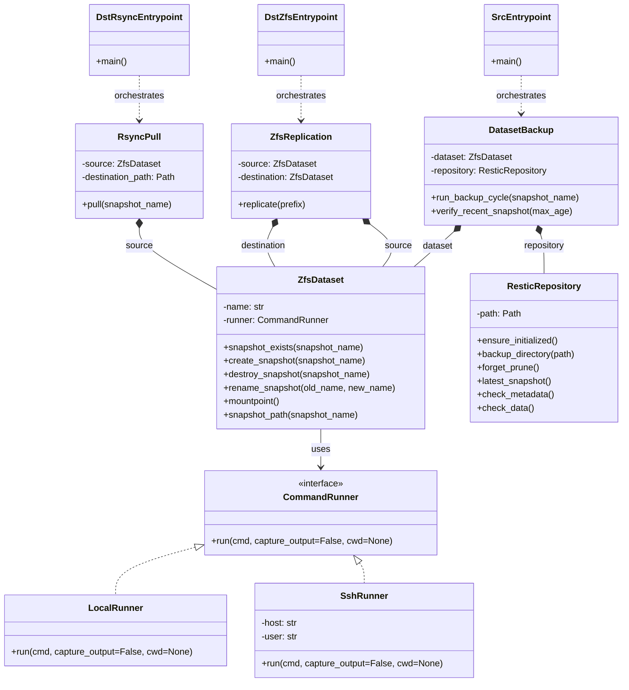

# Dataset Backup Design

## Architecture

The backup system is organized into three layers:

- **Domain layer**: models backup concepts and workflows.
- **Infrastructure layer**: runs shell commands locally or over SSH.
- **Application layer**: CLI entrypoints (`src`, `dst-zfs`, `dst-rsync`) that wire objects and execute flows.

This structure keeps backup logic in domain objects and isolates transport/process concerns.

## Core Domain Objects

### Command runners

- `LocalRunner` executes commands on the local host.
- `SshRunner(host, user)` executes commands on a remote host via SSH.
- Both implement the same command interface (`run(cmd, capture_output=False, cwd=None)`).

Execution location is explicit through dependency injection: each dataset is constructed with one runner.

### `ZfsDataset`

`ZfsDataset(name: str, runner: CommandRunner)` represents one dataset bound to one execution location.

Responsibilities:

- Snapshot lifecycle operations: `snapshot_exists`, `create_snapshot`, `destroy_snapshot`, `rename_snapshot`.
- Dataset metadata lookup: `mountpoint`.
- Snapshot path construction: `snapshot_path(snapshot_name)`.

`ZfsDataset` is the single abstraction used by backup and transfer workflows.

### `ResticRepository`

`ResticRepository(path: Path)` encapsulates repository behavior.

Responsibilities:

- Restic environment setup (`RESTIC_REPOSITORY`, `RESTIC_CACHE_DIR`, feature flags).
- Repository bootstrap: `ensure_initialized`.
- Backup and retention: `backup_directory`, `forget_prune`.
- Verification: latest snapshot retrieval, age/size checks, metadata/data checks.

### `DatasetBackup`

`DatasetBackup(dataset: ZfsDataset, repository: ResticRepository)` models one dataset-to-repository pair.

Responsibilities:

- Execute backup cycle for a snapshot name.
- Coordinate create/backup/prune/cleanup sequence.
- Expose repository validation at pair level.

## Transfer Services

### `ZfsReplication`

`ZfsReplication(source: ZfsDataset, destination: ZfsDataset)` handles dataset replication.

Responsibilities:

- Determine full vs incremental transfer based on `last` snapshot presence on both sides.
- Execute `zfs send | zfs receive` pipeline.
- Rotate snapshots (`current` to `last`) on source and destination.

### `RsyncPull`

`RsyncPull(source: ZfsDataset, destination_path: Path)` handles rsync-based pulls.

Responsibilities:

- Create temporary source snapshot.
- Transfer from source snapshot path (`.zfs/snapshot/<name>/`).
- Ensure snapshot cleanup even on transfer failure.

## Operational Semantics

- **Backup cycle**: create snapshot -> ensure repository -> backup snapshot view -> apply retention -> cleanup snapshot.
- **Replication cycle**: create source `current` -> send/receive full or incremental stream -> rotate `current` to `last` on both sides.
- **Rsync cycle**: create source snapshot -> rsync snapshot tree -> destroy temporary snapshot.

## Invariants

- Each `ZfsDataset` has exactly one runner and therefore one execution location.
- Snapshot operations are only performed through `ZfsDataset` methods.
- Restic commands are only performed through `ResticRepository` methods.
- Backup and transfer workflows compose domain objects; they do not issue ad-hoc dataset shell commands directly.
- Cleanup paths run on best effort and do not suppress primary operation errors.

## Error and Notification Model

- Domain operations raise failures with command context.
- CLI entrypoints aggregate failures for the run.
- Final reporting uses the existing notification mechanism.

## Runtime Contract

- CLI commands: `homelab-backup src`, `homelab-backup dst-zfs`, `homelab-backup dst-rsync`.
- Environment variables remain the runtime contract (for example `SOURCE_HOST`, `SOURCE_USER`, dataset and destination settings).

## Class Diagram

## Design Rationale

- Domain objects provide a stable API for backup behavior.
- Explicit runner injection makes local/remote semantics deterministic.
- Shared `ZfsDataset` usage across restic, ZFS replication, and rsync removes duplicated snapshot logic.
- Layer boundaries improve testability and reduce coupling between orchestration and command execution.
